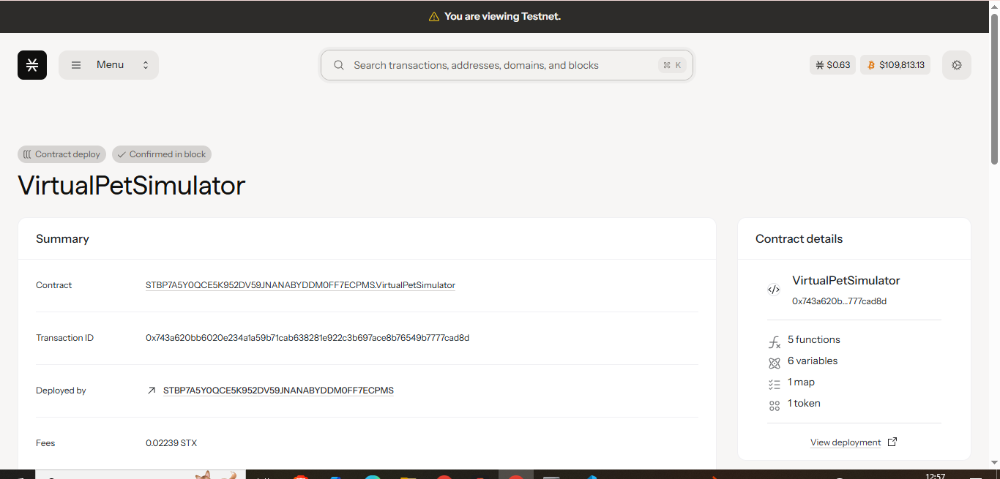

# Virtual Pet Simulator

## Project Description

Virtual Pet Simulator is a blockchain-based pet care game built on the Stacks blockchain using Clarity smart contracts. Players can create, nurture, and care for virtual pets that exist as unique NFTs. The game mechanics revolve around pet health and happiness that decay over time, requiring regular care to maintain pet value and breeding capabilities. Neglect directly affects your pet's blockchain-recorded stats, creating real consequences for poor care.

## Project Vision

Our vision is to revolutionize digital pet ownership by combining the nostalgia of classic virtual pets with the permanence and ownership guarantees of blockchain technology. We aim to create a sustainable ecosystem where:

- **True Ownership**: Pets are NFTs that players genuinely own and can transfer
- **Persistent Care**: Pet status is permanently recorded on-chain, creating lasting consequences for care decisions  
- **Community Driven**: Players can breed, trade, and interact with each other's pets
- **Economic Incentives**: Well-cared pets maintain higher values and breeding capabilities
- **Decentralized Gaming**: No central servers - the game lives entirely on the blockchain

We envision a future where virtual pet care becomes a meaningful, social, and economically rewarding experience that teaches responsibility while providing entertainment.

## Future Scope

### Phase 1 - Core Expansion
- **Breeding System**: Allow pets with high care stats to breed and create offspring with combined traits
- **Pet Evolution**: Pets can evolve based on care history and age milestones
- **Multiple Pet Types**: Cats, dogs, birds, and fantasy creatures with unique care requirements

### Phase 2 - Social Features  
- **Pet Battles**: Turn-based combat system where well-cared pets have advantages
- **Trading Marketplace**: Built-in marketplace for buying/selling pets and care items
- **Guilds & Communities**: Player organizations focused on breeding and care strategies

### Phase 3 - Advanced Mechanics
- **Genetics System**: Complex trait inheritance for breeding with rare characteristics
- **Care Items**: Special foods, toys, and accessories that provide stat bonuses
- **Seasonal Events**: Limited-time breeding opportunities and special pet variants

### Phase 4 - Cross-Chain Integration
- **Multi-Chain Pets**: Pets that can exist across different blockchains
- **Real-World Integration**: IoT devices that can affect pet care (feeding schedules, etc.)
- **AR/VR Compatibility**: Visualize and interact with pets in augmented/virtual reality

### Long-term Vision
- **AI-Powered Personalities**: Each pet develops unique AI-driven behavioral patterns
- **Educational Partnerships**: Collaborate with schools to teach responsibility through pet care
- **Conservation Efforts**: Partner with real animal welfare organizations, where caring for virtual pets contributes to real-world animal care

## Contract Address Details

Contract No: STBP7A5Y0QCE5K952DV59JNANABYDDM0FF7ECPMS.VirtualPetSimulator

### Mainnet
- **Contract Address**: `[To be added after mainnet deployment]`
- **Network**: Stacks Mainnet

### Testnet  
- **Contract Address**: `[To be added after testnet deployment]`
- **Network**: Stacks Testnet

### Development
- **Local Deployment**: Available for local Clarinet testing
- **Contract Name**: `virtual-pet-simulator`

---

*Built with ❤️ on Stacks blockchain using Clarity smart contracts*# Virtual Pet Simulator

## Project Description

Virtual Pet Simulator is a blockchain-based pet care game built on the Stacks blockchain using Clarity smart contracts. Players can create, nurture, and care for virtual pets that exist as unique NFTs. The game mechanics revolve around pet health and happiness that decay over time, requiring regular care to maintain pet value and breeding capabilities. Neglect directly affects your pet's blockchain-recorded stats, creating real consequences for poor care.

## Project Vision

Our vision is to revolutionize digital pet ownership by combining the nostalgia of classic virtual pets with the permanence and ownership guarantees of blockchain technology. We aim to create a sustainable ecosystem where:

- **True Ownership**: Pets are NFTs that players genuinely own and can transfer
- **Persistent Care**: Pet status is permanently recorded on-chain, creating lasting consequences for care decisions  
- **Community Driven**: Players can breed, trade, and interact with each other's pets
- **Economic Incentives**: Well-cared pets maintain higher values and breeding capabilities
- **Decentralized Gaming**: No central servers - the game lives entirely on the blockchain

We envision a future where virtual pet care becomes a meaningful, social, and economically rewarding experience that teaches responsibility while providing entertainment.

## Future Scope

### Phase 1 - Core Expansion
- **Breeding System**: Allow pets with high care stats to breed and create offspring with combined traits
- **Pet Evolution**: Pets can evolve based on care history and age milestones
- **Multiple Pet Types**: Cats, dogs, birds, and fantasy creatures with unique care requirements

### Phase 2 - Social Features  
- **Pet Battles**: Turn-based combat system where well-cared pets have advantages
- **Trading Marketplace**: Built-in marketplace for buying/selling pets and care items
- **Guilds & Communities**: Player organizations focused on breeding and care strategies

### Phase 3 - Advanced Mechanics
- **Genetics System**: Complex trait inheritance for breeding with rare characteristics
- **Care Items**: Special foods, toys, and accessories that provide stat bonuses
- **Seasonal Events**: Limited-time breeding opportunities and special pet variants

### Phase 4 - Cross-Chain Integration
- **Multi-Chain Pets**: Pets that can exist across different blockchains
- **Real-World Integration**: IoT devices that can affect pet care (feeding schedules, etc.)
- **AR/VR Compatibility**: Visualize and interact with pets in augmented/virtual reality

### Long-term Vision
- **AI-Powered Personalities**: Each pet develops unique AI-driven behavioral patterns
- **Educational Partnerships**: Collaborate with schools to teach responsibility through pet care
- **Conservation Efforts**: Partner with real animal welfare organizations, where caring for virtual pets contributes to real-world animal care

## Contract Address Details

*Contract addresses will be added after deployment to mainnet and testnet*

### Mainnet
- **Contract Address**: `[To be added after mainnet deployment]`
- **Network**: Stacks Mainnet

### Testnet  
- **Contract Address**: `[To be added after testnet deployment]`
- **Network**: Stacks Testnet

### Development
- **Local Deployment**: Available for local Clarinet testing
- **Contract Name**: `virtual-pet-simulator`

---
